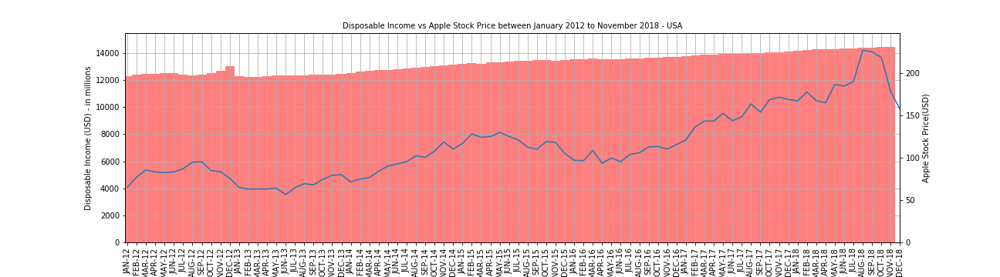

# Project-1-ninjas
### Objective :

This project was to find out if Apple Inc's keynote announcements affect the Apple Inc stock price.

### Authors :

Roy Henry, Lissette Miranda and Emily Mo

### **Data :**

Using python API to retrieve Apple Inc stock prices between January 2012 to December 2018.  Disposable Income from the same period was obtained from Fred Economics.  However, there was no correlation found between them.

<u>Apple Stock Price and Disposable Income Chart between January 2012 and December 2018</u> 

Keynote announcement dates were down downloaded from Apple Inc website as an excel spreadsheet which was then converted to a csv file.  

### Hypothesis :

• Null hypothesis - the means of the stock prices will be no different among the two group of stock dates (non keynote dates and keynote dates)

• Alternative Hypothesis - The means of the closing prices of the two groups will differ significantly

AppleStockvsKeyNoteAnnouncementDates-sns.png

### Statistics Analysis :

From scipy.stats import in Python to run the T Test and the P Value.  Random sample set of 12 keynote
dates to vs. random sample sets of 12 non keynote dates were selected for the T test and P Value.

Five trials with five different random sets for each test.  Comparison was made to the closing prices at month-end.  

The results :

### Technical aspect :

project-1.ipynb (python in jupyter notebook) was the main program which includes :

- matplotlib 
- pandas
- numpy
- Alphavantage Timeseries API
- randint
- scipy.stat
- seaborn
- and dual axes graphs